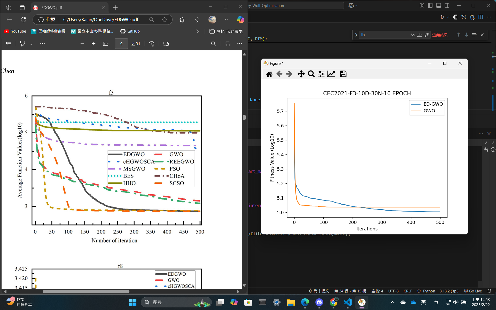
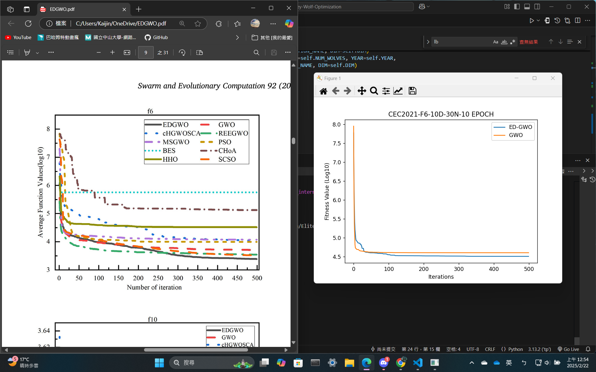
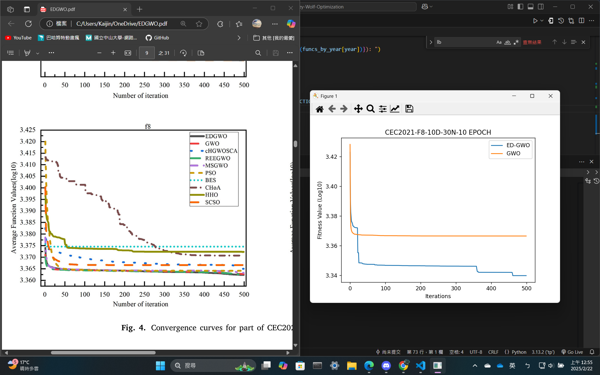
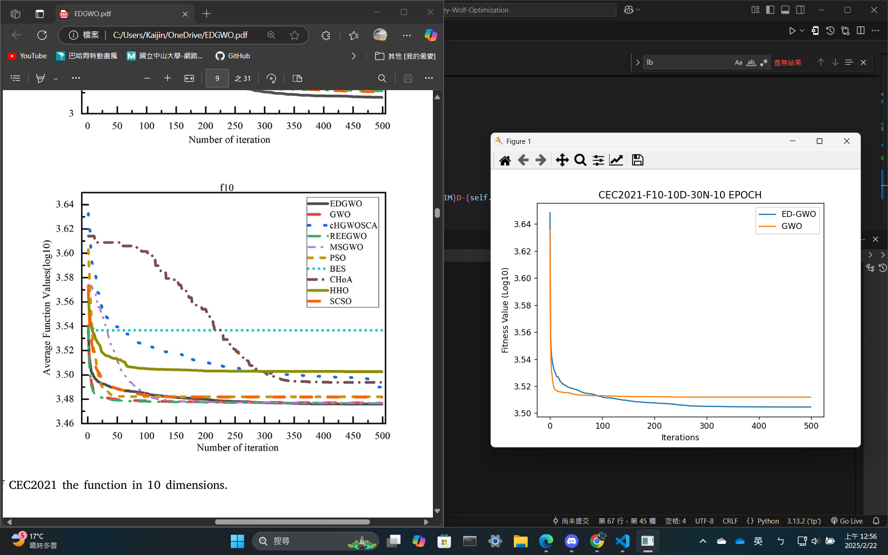
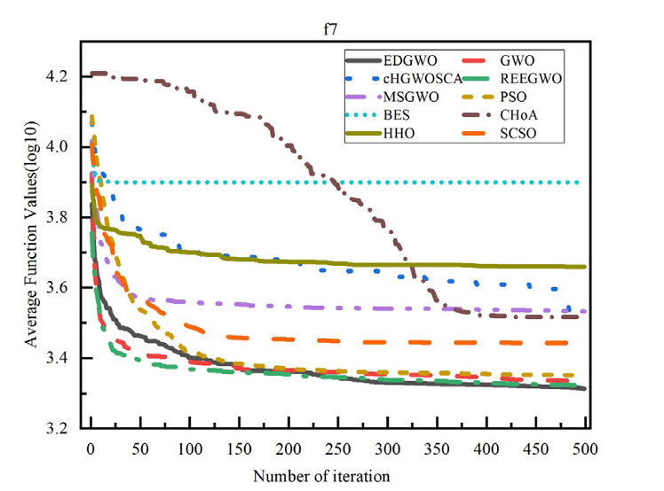
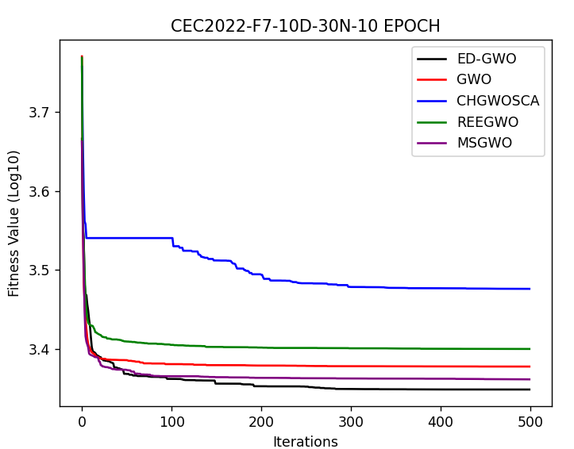

# 移動優化灰狼演算法 Elite-driven-Grey-Wolf-Optimization
> 程式碼內仍有大量的註解內容，其為為後續更新做準備或具備除錯用途
## 使用方法: 
1. 透過執行 `main.py` 來執行程式，會依序呈現不同的適應函數結果，每次呈現皆會有EDGWO和GWO的結果。
2. 透過個別執行 `EDGWO.py` 、 `GWO.py` 、`CHGWOSCA.py`、`REEGWO.py`、`MSGWO.py`來執行程式，可以得到單一演算法對於每個是應函數的結果。

## 程式碼說明:
1. `main.py`: 主程式，此程式包含觀察者主架構組件，可以操控所有變量，並且可以呼叫EDGWO和GWO演算法。
2. `CECData.py`: 適應函數，此程式包含所有的適應函數，可以透過此程式來呼叫適應函數。
3. `EDGWO.py`: EDGWO演算法，此程式包含EDGWO演算法的主要架構，包含初始化、適應函數、更新、選擇等。
4. `GWO.py`: GWO演算法主要架構。
5. `CHGWOSCA.py`: CHGWOSCA演算法主要架構。
6. `REEGWO.py`: REEGWO演算法主要架構。
7. `MSGWO.py`: MSGWO演算法主要架構。

## 觀察者架構
1. MainControl: 主要架構，包含所有的變量，並且可以呼叫EDGWO和GWO演算法。
2. EDGWOControl: EDGWO架構，包含EDGWO演算法的變量，並且可以呼叫EDGWO演算法，並且可以呼叫GWO演算法及處裡回傳結果。
4. Alogs: 演算法架構，包含演算法的變量，並且可以呼叫演算法的初始化、適應函數、更新、選擇等。

## 實驗結果與論文對照(GWO+EDGWO)

## 實驗結果與論文對照(GWO+EDGWO+CHGWOSCA+REEGWO+MSGWO)

完成日期: 2024/02/21

