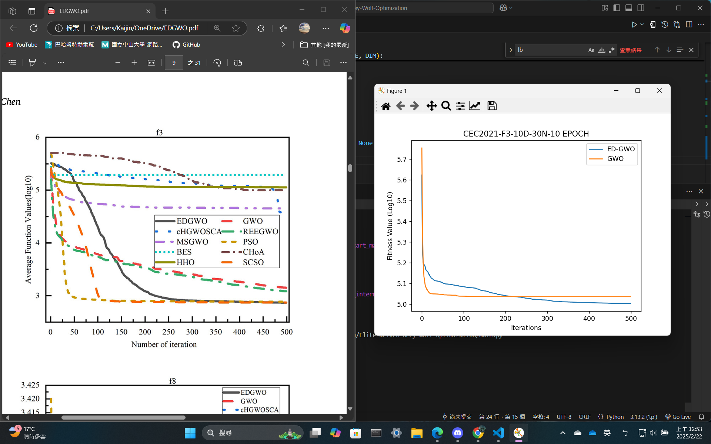

# 移動優化灰狼演算法 Elite-driven-Grey-Wolf-Optimization

## 使用方法: 
1. 透過執行 `main.py` 來執行程式，會依序呈現不同的適應函數結果，每次呈現皆會有EDGWO和GWO的結果。
2. 透過個別執行 `EDGWO.py` 和 `GWO.py` 來執行程式，可以得到單一演算法對於每個是應函數的結果。

## 程式碼說明:
1. `main.py`: 主程式，此程式包含觀察者主架構組件，可以操控所有變量，並且可以呼叫EDGWO和GWO演算法。
2. `EDGWO.py`: EDGWO演算法，此程式包含EDGWO演算法的主要架構，包含初始化、適應函數、更新、選擇等。
3. `GWO.py`: GWO演算法，此程式包含GWO演算法的主要架構，包含初始化、適應函數、更新、選擇等。
4. `benchmark.py`: 適應函數，此程式包含所有的適應函數，可以透過此程式來呼叫適應函數。

## 觀察者架構
1. MainControl: 主要架構，包含所有的變量，並且可以呼叫EDGWO和GWO演算法。
2. EDGWOControl: EDGWO架構，包含EDGWO演算法的變量，並且可以呼叫EDGWO演算法，並且可以呼叫GWO演算法及處裡回傳結果。
3. GWOControl/EDGWO: GWO架構，包含演算法的變量，並且可以呼叫GWO演算法及處裡回傳結果
4. GWO/EDGWO: 演算法架構，包含演算法的變量，並且可以呼叫演算法的初始化、適應函數、更新、選擇等。

## 實驗與論文對照

完成日期: 2024/02/21