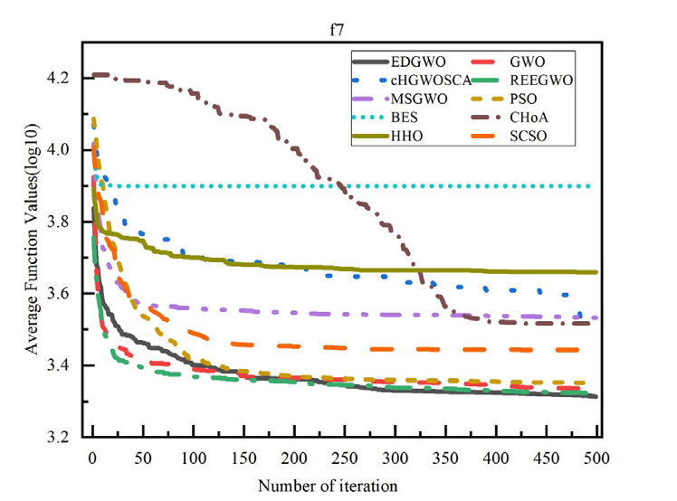
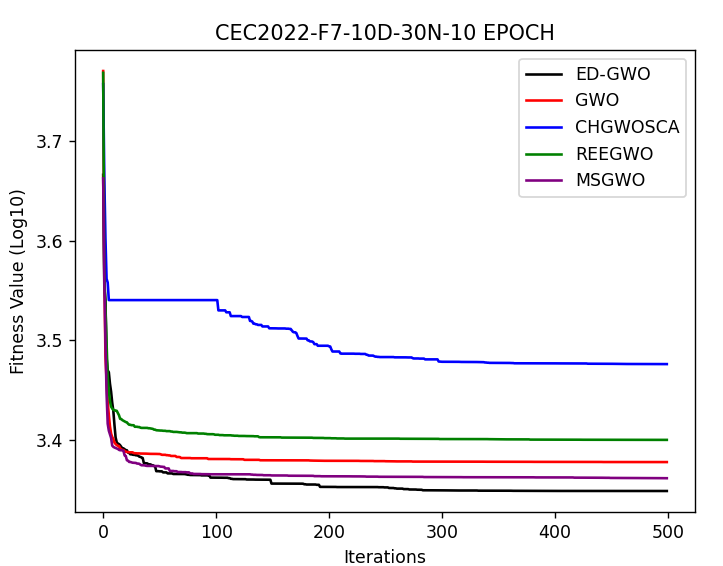

# 移動優化灰狼演算法 Elite-driven-Grey-Wolf-Optimization
> 程式碼內仍有大量的註解內容，其為為後續更新做準備或具備除錯用途
## 使用方法: 
本專案實作了 **Elite-driven Grey Wolf Optimization (EDGWO)**，並比較多種論文中提及的優化演算法的性能，適用於不同的數據集與適應函數 (CEC Dataset與Gene Dataset)。程式允許使用者選擇特定的函數來進行優化，並透過**平行計算**執行多種演算法，最終輸出優化結果與可視化圖表。
1. 透過執行 `main.py` 來執行程式，會依序呈現不同的適應函數結果，每次呈現皆會有EDGWO和GWO的結果。
2. 執行 `LiveDemo.py` 來觀察演算法的實時演算結果，進行可視化演算法比較。(但方法尚未完善)

## 程式碼說明:
1. `main.py`: 主程式，此程式包含觀察者主架構組件，可以操控所有變量，並且可以呼叫EDGWO和GWO演算法。
2. `DataSet.py`: 適應函數，此程式包含所有的適應函數，可以透過此程式來呼叫適應函數。
3. `ConfigClass`: 設定檔，此程式包含所有的設定檔，可以透過此程式來設定部分的變量。
3. `演算法.py`: 各式演算法，包含演算法的主要架構，包含初始化、適應函數、更新、選擇以該演算法與主程式的交互介面

## 觀察者架構
1. MainControl: 主要架構，包含所有的變量，並且可以呼叫EDGWO和GWO演算法。
2. EDGWOControl: EDGWO架構，包含EDGWO演算法的變量，並且可以呼叫EDGWO演算法，並且可以呼叫GWO演算法及處裡回傳結果。
4. Algos: 演算法架構，包含演算法的變量，並且可以呼叫演算法的初始化、適應函數、更新、選擇等。

### 1. 連續函數實驗結果與論文對照(GWO / EDGWO / CHGWOSCA / REEGWO / MSGWO)

    

        

            
        

        

            
        

    

    完成日期: 2024/02/21

### 2. 連續函數實驗結果與論文對照(10種)

    

        

            
        

        

            
        

    

    完成日期: 2024/02/21

### 3. 自優化(REIN-EDGWO) vs EDGWO 實驗對照 :
我們有稍微針對EDGWO進行了一些改進，並且將其命名為REIN-EDGWO，並且進行了一些實驗，結果如下:

    

        

            
        

        

            
        

    

    完成日期: 2024/02/26

### 3. 離散資料實驗結果與論文對照(10種optimizer):

    

        

            
        

        

            
        

    

    完成日期: 2024/02/26

## 未來可改進: 
1. LiveDemo 形式 _(已大致完成)_: 可同時觀測多個演算法的實時演算結果，進行可視化演算法比較
