# 移動優化灰狼演算法 Elite-driven-Grey-Wolf-Optimization
> 程式碼內仍有大量的註解內容，其為為後續更新做準備或具備除錯用途
## 使用方法: 
本專案實作了 **Elite-driven Grey Wolf Optimization (EDGWO)**，並比較多種論文中提及的優化演算法的性能，適用於不同的數據集與適應函數 **(CEC Dataset與Gene Dataset)**。使用者可以透過輸入選擇特定的函數來進行優化，並透過**平行計算**執行多種演算法，最終輸出優化結果與可視化圖表。
1. ### 執行 `main.py` 進行優化測試
   主程式會執行不同的優化演算法，並針對所選**fitness function**進行多次iterations，運行後可透過輸入來選擇測試參數。
2. ### 設定優化演算法 `ConfigClass.py`
   透過調整 `ConfigClass.py` 選擇可用演算法的class
3. ### Fitness function/Dataset `DataSet.py`
   該檔案負責管理 CEC 和基因數據集的Fitness function

## 程式碼說明:
1. `main.py`: 主程式，此程式包含觀察者主架構組件，可以操控所有變量，並且可以呼叫EDGWO和GWO等演算法。
2. `DataSet.py`: 適應函數(Fitness function)，此程式包含所有的適應函數，可以透過此程式來呼叫適應函數。
3. `ConfigClass`: 設定檔，此程式包含所有的設定檔，可以透過此程式來設定部分的變量。
3. `演算法.py`: 各式演算法，包含演算法的主要架構，包含初始化、適應函數、更新、選擇以該演算法與主程式的交互介面。

## 觀察者架構
1. MainControl: 主要架構，包含所有的變量，並且可以呼叫EDGWO和GWO演算法。
2. EDGWOControl: EDGWO架構，包含EDGWO演算法的變量，並且可以呼叫EDGWO演算法，並且可以呼叫其它演算法及處裡回傳結果。
3. Algos: 包含11種演算法架構，內有演算法的變量，並且可以呼叫演算法的初始化、適應函數、更新、選擇等。
   > `REINEDGWO.py`為優化版的EDGWO演算法

# 實驗數據
## 1. 連續函數實驗結果與論文對照
### CEC2021 In 10-Dimension
| 論文數據 | 我的結果 |
|----------|---------|
| 📌 F3 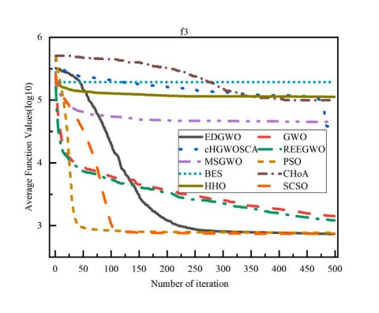 | ✅ F3 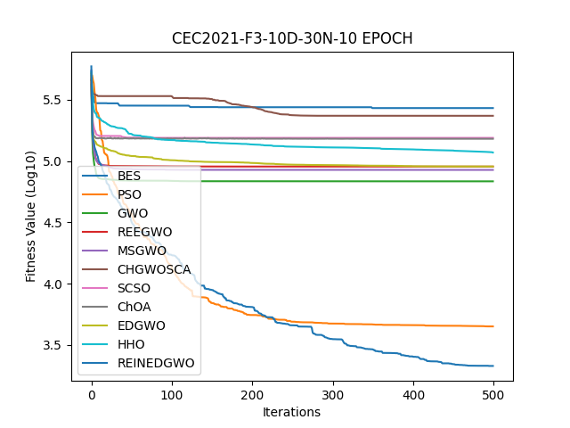 |
| 📌 F6 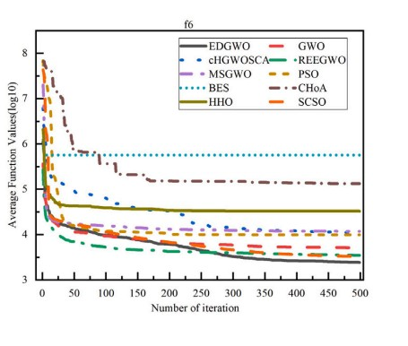 | ✅ F6 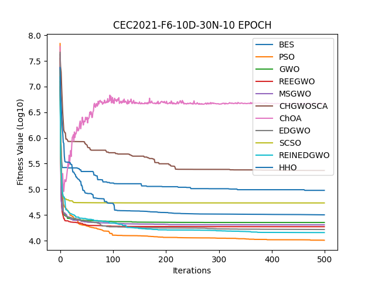 |
| 📌 F8  | ✅ F8 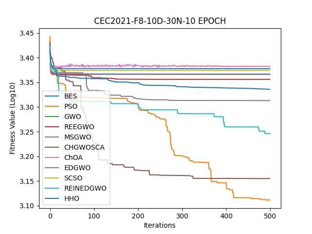 |
| 📌 F10 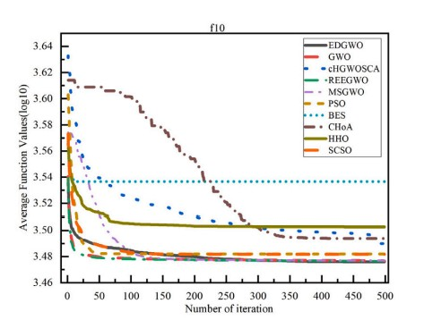 | ✅ F10 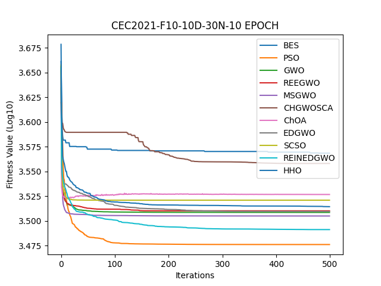 |

### CEC2021 In 20-Dimension
| 論文數據 | 我的結果 |
|:--------:|:--------:|
| 📌 F4 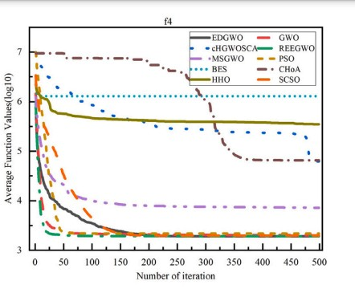 | ✅ F4 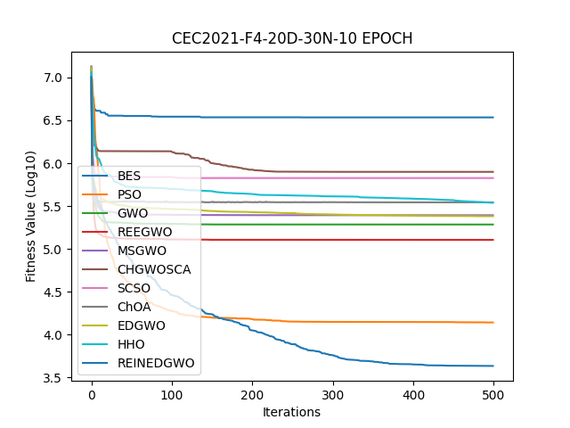 |
| 📌 F7 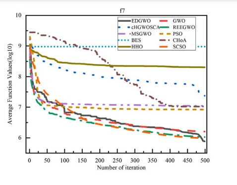 | ✅ F7 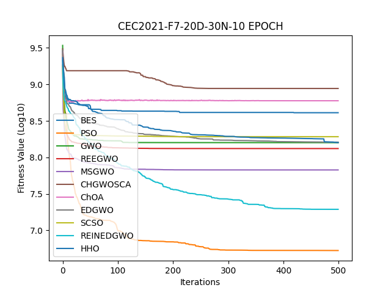 |
| 📌 F8 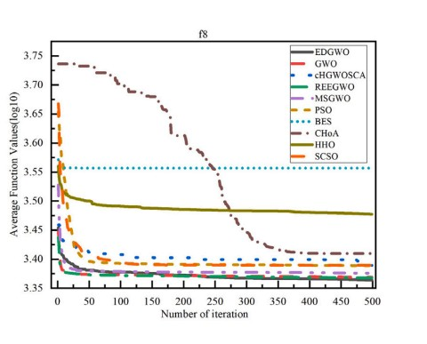 | ✅ F8 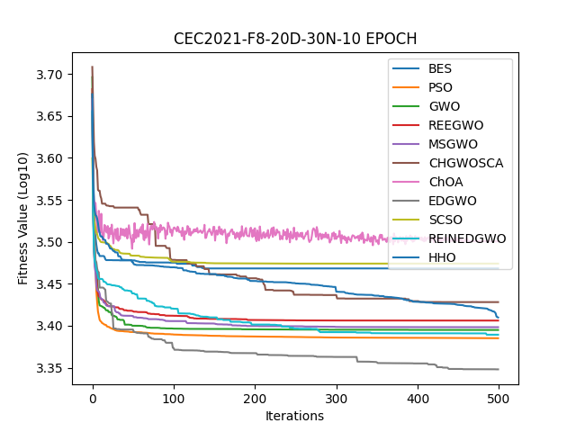 |
| 📌 F9 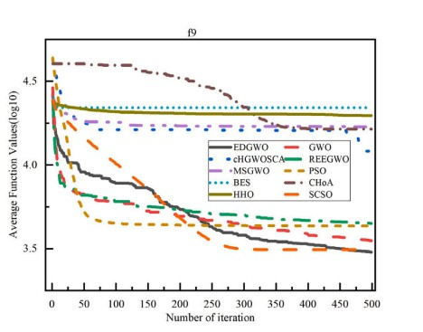 | ✅ F9 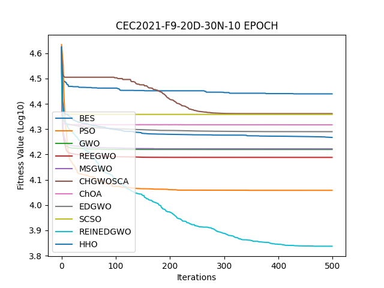 |

### CEC2022 In 10-Dimension
| 論文數據 | 我的結果 |
|:--------:|:--------:|
| 📌 F2 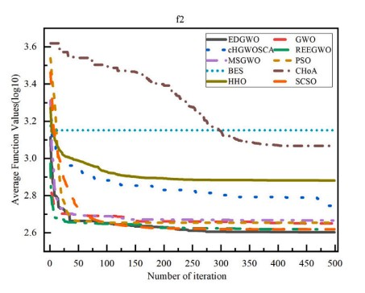 | ✅ F2 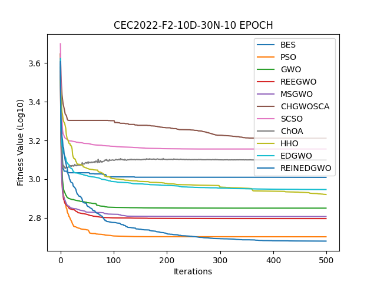 |
| 📌 F6 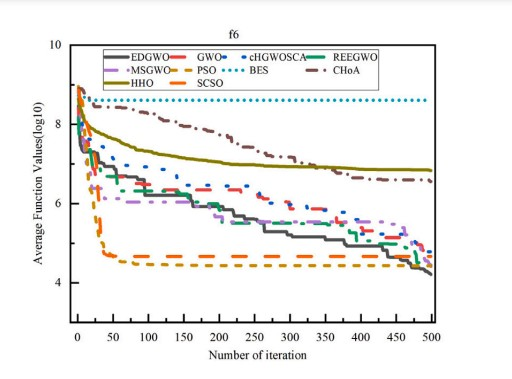 | ✅ F6  |
| 📌 F8 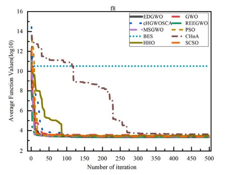 | ✅ F8 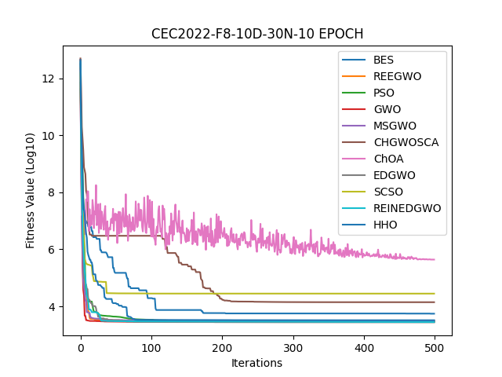 |
| 📌 F12 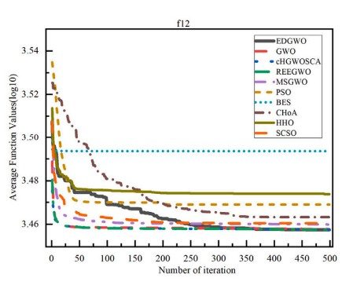 | ✅ F12 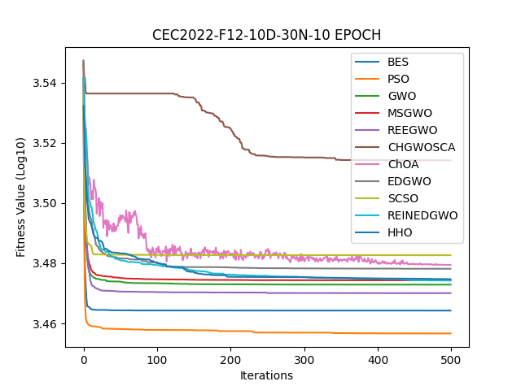 |

### CEC2022 In 20-Dimension
| 論文數據 | 我的結果 |
|:--------:|:--------:|
| 📌 F7 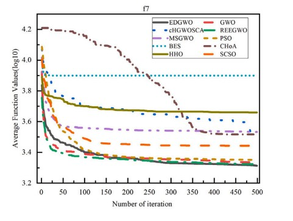 | ✅ F7 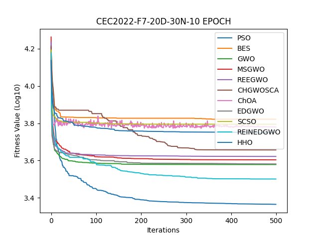 |
| 📌 F9 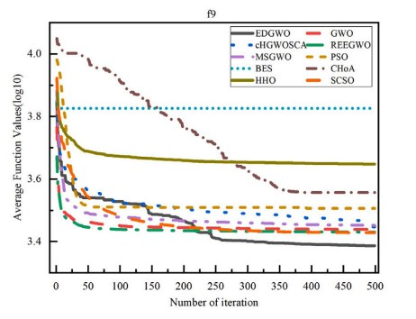 | ✅ F9 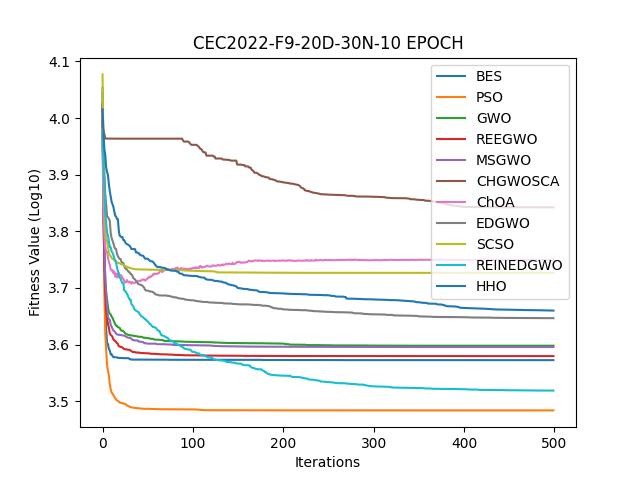 |
| 📌 F10 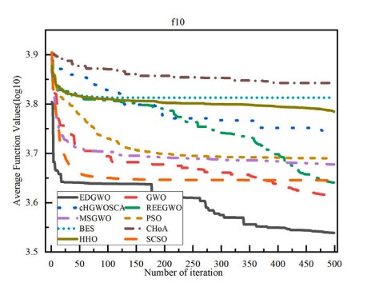 | ✅ F10 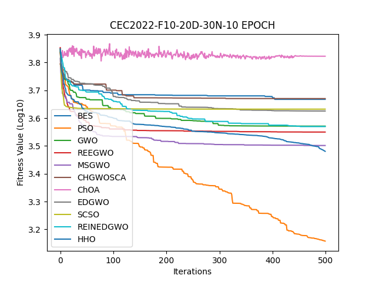 |
| 📌 F11 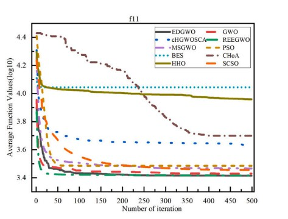 | ✅ F11 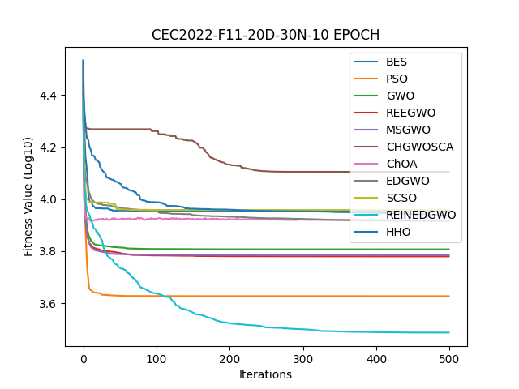 |

### 2. 自優化REIN-EDGWO vs EDGWO 實驗對照 :
我們有稍微針對EDGWO進行了一些改進，並且將其命名為REIN-EDGWO，主要優化方式如下:
1. #### 指數衰減 `(a = 2 * np.exp(-t / self.MAX_ITER))`
- 作用：控制搜索範圍，讓早期探索空間較大，後期收斂較快。
- 優勢：避免收斂過慢，提高全局(global)搜索能力。
2. #### 自適應突變 `(if (self.PreAlpha_score - self.alpha_score) < eps)`
- 作用：當最佳適應值變化極小時，對 10% 的個體進行突變，擾動隨時間遞減。
- 優勢：避免陷入局部最佳解，提供額外的探索能力。
3. #### 多樣性維護 `(if diversity < 0.01 * np.mean(self.ub - self.lb):)`
- 作用：當群體多樣性過低時，隨機重置 20% 的狼，確保狼群不會過度集中。
- 優勢：防止搜索範圍過度收縮，提高演算法的適應性

並且進行了一些實驗，結果如下:

    

        

            
        

        

            
        

       

            
        

    

### 3. 離散資料實驗結果與論文對照(10種optimizer):

    

        

            
        

        

            
        

    

## 總結 (Summary)
本專案：
- **實作了 EDGWO，並針對 EDGWO 進行強化，透過實驗數據顯示REIN-EDGWO 在多數函數上優於 EDGWO**
- **比較了多種演算法的適應值與收斂速度**
- **以Dataset驗證演算法之效能
- **提供收斂曲線圖與數離散資料實驗結果，量化演算法優化效果，使結果更具說服力。

## package requires 
-opfunu 
-numpy
-Matplotlib
-tqdm 
-scipy
-scikit-learn

## 未來可改進: 
1. LiveDemo 形式 _(已大致完成)_: 可同時觀測多個演算法的實時演算結果，進行可視化演算法比較
