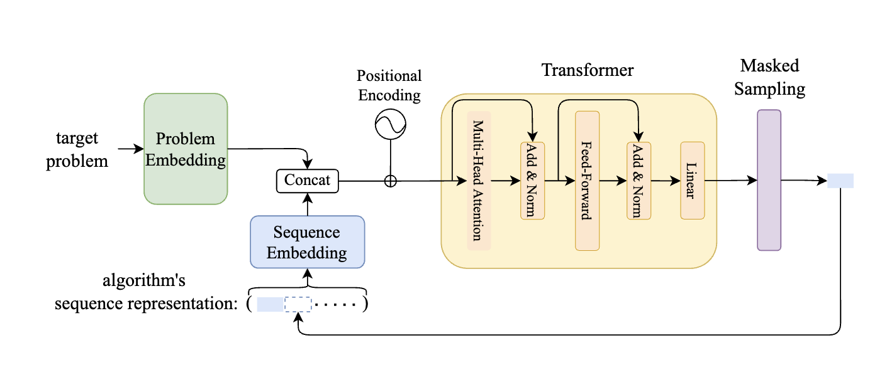

# Automated-Metaheuristic

## packages

- python
- pytorch
- matplotlib

## 實現方法

使用論文中關於transformer的圖片做舉例，並將整體拆分成幾個要點：

- target problem form (輸入問題的形式)
- embedding model （嵌入模型）
- transformer
- hyper-parameter optimizer [type: meta-heuristic algorithm]
    （超參數優化器 [形式：元啟發式演算法]）
- evaluation metric （評估指標）
- meta-heuristic algorithm pool （演算法池）



1. target problem form: 將使用 CEC benchMark (2005~2025)
2. embedding model: 目前將使用現成的 embedding model 進行試驗（未來將額外計劃訓練該 embedding model）

3. transformer:
    - 將使用現成的 transformer 進行遷移訓練（transfer training）（未來將額外計劃從頭訓練 transformer）
    - 訓練將使用 CEC 2024~2025 以外的 benchmark function當作train data

4. hyper-parameter optimizer：
    - 使用差分進化 (視時間成本來增加更多組調整/對照)
    - 包含一個 attention 機制 (記憶歷史狀態當作獎罰機制加速收斂)

    ```mermaid
    graph TD
    A[Current Solution] --> B[Attention Gate]
    C[Historical Best Solution] --> B
    D[Recent Improved Solutions] --> B
    B --> E[Weight Fusion]
    E --> F[New Search Direction]
    ```

5. evaluation metric for tansformer:
    - 訓練將使用 CEC 2024~2025 以外的 benchmark function當作 valid data
    - 將根據loss function 來評估 transformer 的表現

6. meta-heuristic algorithm pool:
    - 使用先前的 GWO 系列演算法當做演算法池
    - 將根據 transformer 的輸出來決定使用哪些演算法組合

<!-- RL -->

## 評估指標

1. 最終收斂結果 (fitness value)
2. 收斂速度 (iterations)
3. 族群多樣性 (收斂情況)

## 對比實驗設計


## questions

    - 我們該如何evaluate特定組合的算法的成效？（迭代演算法組合？隨機抽選？ 部件重組？）